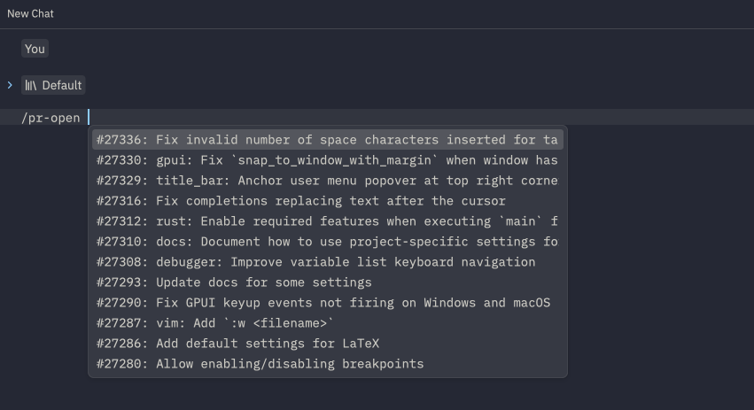

# Github Context

Extention to Zed Editor to provide Github context for AI. This is usefull for improving code after a pull request has gotten feedback.

## Commands
### `/pr-current`

Takes in context from pull requests that matches current branch and comments on the PR.

**Note:** This only works in Zed Preview. Is dependent on zed_extension_api 0.3.0. Uses `git` from command line to get current branch and repository.

### `/pr-link "link to github PR"`

### `/pr-open`

List Pull Request from current repository

**Note:** This command does not work, as the workspace cannot be accessed in `run_slash_command`.

## Configuration

This extension requires three environment variables to be set:

| Variable | Description |
|----------|-------------|
| `GITHUB_TOKEN` | A personal access token for Github that can access issues and pull requests (read only) |

# Acknowledgments
- [jira-slash-command extension](https://github.com/trbroyles1/jira-slash-command/tree/ab76298a0007b7395a739aa91ad0ffc3ff35f7e6) for inspiration (and some code)
- Github Copilot, that wrote most of the code for me (i'll properly learn rust at some point, i promise)
- [Life of a Zed Extension: Rust, WIT, Wasm](https://zed.dev/blog/zed-decoded-extensions) by Thorsten Ball, Max Brunsfeld, and Marshall Bowers for helping me understand how Zed extensions work
- [Zed example slash command extension](https://github.com/zed-industries/zed/tree/main/slash-commands-example) for providing examples on how to create slash commands
- Creators of Zed, for making a great editor
